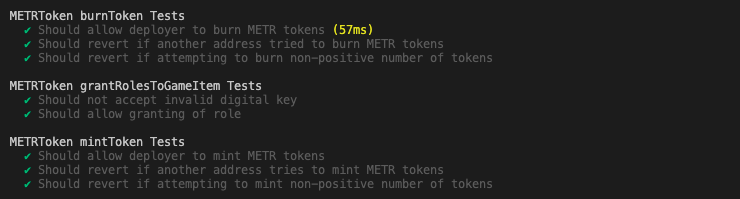

# 
MetaRanger_v1

 
This project is a proof of concept for a Web3 dApp build in Unity that interacts with smart contracts. The project takes the form of a first person shooter, built on top of ["Unity's FPS Microgame"](https://learn.unity.com/project/fps-template) that uses an in-game currency in the form of an [ERC20 token](https://ethereum.org/en/developers/docs/standards/tokens/erc-20/), to allow the user to purchase in-game items in the form of [ERC1155 tokens](https://ethereum.org/en/developers/docs/standards/tokens/erc-1155/). The game uses the [ChainSafe Gaming SDK](https://gaming.chainsafe.io/) to facilitate its connection to the blockchain to read and write to the relevant smart contracts, which have been deployed to the [Polygon Mumbai testnet](https://www.alchemy.com/overviews/mumbai-testnet).

 
NOTE: This project is a proof of concept, and not intended to represent a polished Web3 game. The contracts used in this application have not been audited, and I take no responsiblity for issues which may arise out of their extended use.

## Web3 In-Game Items
The items within the game that are represented by the ERC1155 are the Vitality Items; including Health, Armour, and Shields, the additional Weapons; Disc Launcher, Shotgun, and Sniper, and the various Weapon Upgrades for each item. These items can be exchanged for accrued METR tokens (the ERC20), within the Loadout menu. The following screenshots are how these items and menus are displayed within the game. (All mockups were made with [Figma](https://www.figma.com/).)

### Loadout Power Ups

### Loadout Weapons

### Blaster Upgrade Tree

### Disc Launcher Upgrade Tree

### Shotgun Upgrade Tree

### Sniper Upgrade Tree

### Jetpack Upgrade Tree

## Deployed Contracts (Mumbai Polyscan)

- [Game Manager](https://mumbai.polygonscan.com/address/0xd45dEF180645269b81eFEaFE8D4D83f368B5adc6)
- [Vitality Items](https://mumbai.polygonscan.com/address/0x85B3C588912Cbd2F415bFBC4A34f069554385663)
- [METR Token](https://mumbai.polygonscan.com/token/0x22ac36f2932c73559df2b288a375e12c8fa9b7db)
- [Blaster Game Item](https://mumbai.polygonscan.com/address/0xcd8a7e2ec16fb3ff6fad142dc30cdb8c2237348b)
- [Disc Launcher Game Item](https://mumbai.polygonscan.com/address/0x7d41e26d950908ab5d44611171cc7a2acc0a7aba)
- [Shotgun Game Item](https://mumbai.polygonscan.com/address/0xbe8af99a91b85ab400ab7f0901556a9c28d08ad2)
- [Sniper Game Item](https://mumbai.polygonscan.com/address/0x71d3529831ea10706f617654188e6aabc9b102b2)
- [Jetpack Game Item](https://mumbai.polygonscan.com/address/0xdf289994a3809592392cd3e4129d10fada0be03e)

## Test Coverage

## Example In-Game Contract Interactions

